<div align="center">

# 👋 Hi, I'm Harsha!


### 🎓 Final Year B.Tech CSE (AI & ML) | VIT-AP University
### 🚀 Building intelligent systems & beautiful interfaces

[](https://linkedin.com/in/yourprofile)
[](https://github.com/Harsha2614)
[](mailto:your.email@example.com)

</div>

---

## 🚀 About Me

```python
class AIEngineer:
    def __init__(self):
        self.name = "Harsha"
        self.role = "AI & ML Engineer"
        self.education = "B.Tech CSE (AI & ML) @ VIT-AP"
        self.interests = ["Deep Learning", "Reinforcement Learning", "Web Dev"]
        self.current_focus = "Building intelligent AI solutions"
    
    def say_hi(self):
        print("Thanks for dropping by! Let's build something amazing together 🚀")

me = AIEngineer()
me.say_hi()
```

<div align="center">

### 💡 Core Strengths

| 🎯 **Focus Areas** | 🛠️ **Skills** |
|:---:|:---:|
| Machine Learning | Model Development & Optimization |
| Deep Learning | CNNs, Transfer Learning, Computer Vision |
| Reinforcement Learning | Q-Learning, Policy Optimization |
| Full Stack Development | React, TypeScript, TailwindCSS |

</div>

---

## 🛠️ Tech Arsenal

<div align="center">

### 👨‍💻 Languages & Frameworks


### 🎨 Frontend & UI


### 🤖 AI/ML & Data Science


### 🗄️ Databases & Tools


</div>

---

## 🌟 Featured Projects

<div align="center">

<table>
<tr>
<td width="50%">

### 📦 E-commerce Shipping Prediction
[](https://github.com/Harsha2614/Ecommerce-shipping-prediction-using-Machine-learning-.git)

**🎯 Challenge:** Predict on-time delivery for 10,999 shipments

**💡 Solution:**
- Implemented multiple ML/DL models
- Random Forest with hyperparameter tuning
- Achieved **68.52% accuracy**

**🛠️ Tech:** Python, Scikit-learn, Pandas, Random Forest

</td>
<td width="50%">

### 🧑‍🦱 Facial Age Detection
[](https://drive.google.com/file/d/1bkzv-kdfWnyhbELZ7BmSsMvNMHBUwB6S/view?usp=sharing)

**🎯 Challenge:** Accurate age prediction from facial images

**💡 Solution:**
- CNN with Residual Blocks & Dropout
- Trained on 20,000+ UTKFace images
- **MAE ≈ 4.8 years**

**🛠️ Tech:** TensorFlow, CNN, AdamW Optimizer

</td>
</tr>
<tr>
<td width="50%">

### 🚕 Q-Learning Taxi Navigation
[](https://github.com/Harsha2614/Q-Learning-for-Autonomous-Taxi-Navigation.git)

**🎯 Challenge:** Autonomous taxi navigation with constraints

**💡 Solution:**
- Q-Learning agent in OpenAI Gym Taxi-v3
- Incorporated traffic & weather dynamics
- Energy-efficient route optimization

**🛠️ Tech:** Python, OpenAI Gym, Reinforcement Learning

</td>
<td width="50%">

### 🔮 Your Next Project?
**Got an idea? Let's collaborate!**

I'm always open to:
- 🤝 Collaborating on AI/ML projects
- 💡 Innovative full-stack applications
- 🎓 Research opportunities
- 🚀 Open source contributions

[📧 Get in touch!](mailto:your.email@example.com)

</td>
</tr>
</table>

</div>

---

## 🏆 Certifications & Achievements

<div align="center">

| 🎖️ Certification | 🏢 Issuer | 📊 Score |
|:---|:---:|:---:|
| ☁️ **AWS Certified Cloud Practitioner** | Amazon Web Services | **963/1000** 🔥 |
| 🤖 **AI using Google TensorFlow** | Smartbridge + Google | ✅ Certified |
| 🌐 **Oracle Cloud Infrastructure Generative AI Professional** | Oracle | **90%** 🎯 |

</div>

---

## 📊 GitHub Analytics

<div align="center">
  


</div>

<div align="center">
  
[](https://git.io/streak-stats)

</div>

---

## 🎯 Current Focus

```mermaid
graph LR
    A[🎓 Learning] --> B[Advanced Deep Learning]
    A --> C[Cloud Architecture]
    A --> D[MLOps & Deployment]
    
    E[🚀 Building] --> F[AI Applications]
    E --> G[Full-Stack Projects]
    E --> H[Open Source Tools]
    
    I[🤝 Contributing] --> J[Research Papers]
    I --> K[Open Source]
    I --> L[Tech Community]
```



---

## 💬 Let's Connect!

<div align="center">

**I'm always excited to discuss AI, collaborate on projects, or just chat about tech!**

[](https://linkedin.com/in/yourprofile)
[](https://github.com/Harsha2614)
[](mailto:your.email@example.com)
[](https://yourportfolio.com)

---

### 💭 *"The best way to predict the future is to invent it."* - Alan Kay


</div>
